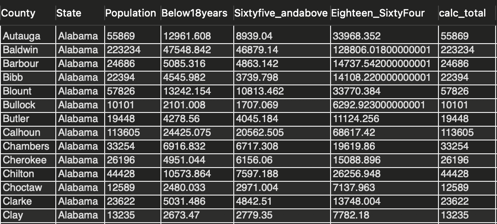

The county health data has '% below 18 years of age' and '% 65 and older' in each county in the United States. It also has the Population for each county. I created a Scalar Function in MySQL that takes the population and percentage and returns the number of people. I used the function a couple of times to calculate the '# of people aged 18-64'. This scalar function can now be used to calculate number of people from a certain demographic given the percentage.

First, I created a Scalar Function, numberofpeople, using the following query. I used this article by Mohammad Nurrokim (https://mohammadnurrokim.medium.com/people-analytics-using-sql-scalar-function-59edc7cab2bb) and MySQL documentation (https://dev.mysql.com/doc/refman/8.0/en/create-procedure.html) as references.

```mysql
CREATE 
FUNCTION County Health Data.numberofpeople(pop INT, percent DEC(10,2)) 
RETURNS DOUBLE 
READS SQL DATA 
  DETERMINISTIC 
RETURN (pop * (percent/100));
```
I then used the query below to get the following columns: County, State, Population, Below18years, Sixtyfive_andabove, Eighteen_SixtyFour (Between 18-64), calc_total (to check if the function worked as I wanted it to work).

```mysql
SELECT *, (Below18years + Sixtyfive_andabove + Eighteen_SixtyFour) AS calc_total
FROM
(SELECT County, Population, Below18years, Sixtyfive_andabove, (Population - (Below18years + Sixtyfive_andabove)) AS Eighteen_SixtyFour
FROM
(SELECT County, State, Population, `% Less Than 18 Years of Age`, numberofpeople(Population, `% Less Than 18 Years -- of Age`) AS Below18years, numberofpeople(Population, `% 65 and Over`) AS Sixtyfive_andabove
 FROM county_data) AS A) AS B
```

I got the following result: 




